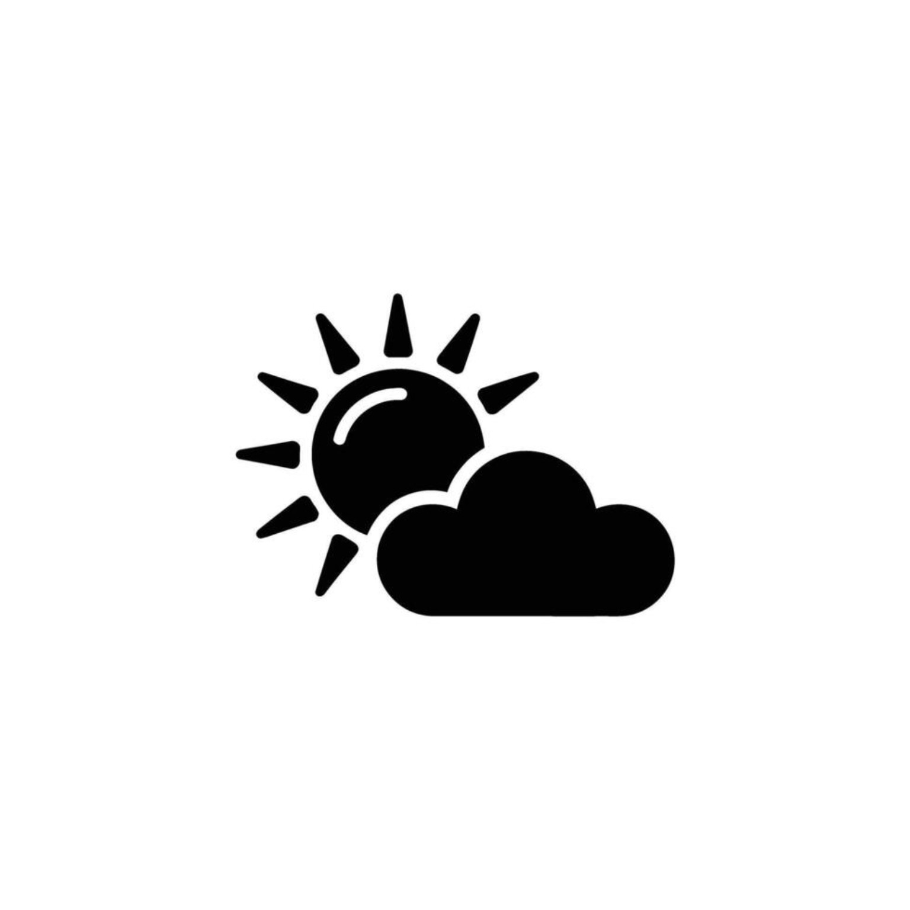

# HzClima

<p align="center">
  
</p>

<p align="center">
  <strong>App de clima moderno, rápido e offline-friendly</strong><br/>
  Desenvolvido em Flutter com Material Design 3
</p>

<p align="center">
  
  
  
  
  
</p>

---

## 📱 Screenshots

<p align="center">
  
</p>

<p align="center">
  <em>Tela principal — clima atual, métricas e previsão</em>
</p>

<p align="center">
  
  
  
  
</p>

<p align="center">
  
  
  
</p>

---

## ✨ Funcionalidades

* **Clima em tempo real** via [Open-Meteo](https://open-meteo.com/) (sem API key)
* **Busca por cidade** com **autocomplete** (debounce)
* **Localização atual** (GPS + reverse geocoding)
* **Previsão de 5 dias**
* **Métricas extras**: umidade, sensação térmica, precipitação e vento
* **Alternância °C / °F** (persistida)
* **Favoritos de cidades** (SharedPreferences)
* **Tema claro e escuro** (Material 3 + system)
* **Splash animada** com logo
* **Pull-to-refresh**
* **Mensagens de erro claras** (sem internet, timeout, cidade não encontrada)
* **Botão voltar inteligente** (fecha teclado/sugestões → dois toques para sair)
* **Animações** de loading, transição de conteúdo e splash

---

## 🛠️ Stack & Competências

### Linguagens e frameworks

| Tecnologia            | Uso no projeto                                        |
| --------------------- | ----------------------------------------------------- |
| **Dart 3**            | Linguagem principal                                   |
| **Flutter**           | UI multiplataforma (Android / iOS / Web / Desktop)    |
| **Material Design 3** | Design system, temas light/dark, componentes modernos |

### Arquitetura e organização

| Competência                        | Como foi aplicada                                                   |
| ---------------------------------- | ------------------------------------------------------------------- |
| **Clean Architecture (camadas)**   | `models` · `services` · `providers` · `pages` · `widgets` · `utils` |
| **State Management**               | `Provider` + `ChangeNotifier`                                       |
| **Separação de responsabilidades** | UI desacoplada da lógica de negócio e da API                        |
| **Helpers reutilizáveis**          | `WeatherCodeHelper` (ícones, descrições e gradientes)               |

### Dados e rede

| Competência                     | Como foi aplicada                                              |
| ------------------------------- | -------------------------------------------------------------- |
| **Consumo de API REST**         | HTTP + JSON (`http`)                                           |
| **Open-Meteo Forecast API**     | Temperatura, vento, umidade, sensação, precipitação e forecast |
| **Open-Meteo Geocoding API**    | Busca de cidades + autocomplete                                |
| **Reverse geocoding**           | Nome da cidade a partir de lat/lon                             |
| **Tratamento de erros de rede** | `SocketException`, `TimeoutException`, mensagens amigáveis     |
| **Timeouts**                    | Requisições com limite de tempo                                |

### Dispositivo e persistência

| Competência                      | Como foi aplicada                                |
| -------------------------------- | ------------------------------------------------ |
| **Geolocalização**               | `geolocator` + permissões de localização         |
| **Armazenamento local**          | `shared_preferences` (favoritos e unidade °C/°F) |
| **Internacionalização de datas** | `intl` com locale `pt_BR`                        |

### UX / UI

| Competência                        | Como foi aplicada                                                             |
| ---------------------------------- | ----------------------------------------------------------------------------- |
| **Animações**                      | `AnimationController`, `FadeTransition`, `SlideTransition`, `ScaleTransition` |
| **Empty / Loading / Error states** | Estados visuais claros e consistentes                                         |
| **Autocomplete com debounce**      | Sugestões de cidade enquanto digita                                           |
| **Chips de favoritos**             | Acesso rápido às cidades salvas                                               |
| **Gradientes dinâmicos**           | Cores do card conforme o código do clima                                      |
| **Navegação Android**              | `PopScope` + duplo voltar para sair                                           |
| **Splash screen**                  | Branding + transição suave para a Home                                        |

### Qualidade

| Competência               | Como foi aplicada                                      |
| ------------------------- | ------------------------------------------------------ |
| **Null-safety**           | Código 100% null-safe                                  |
| **Widgets reutilizáveis** | `WeatherCard`, `ForecastList`, `ErrorViewer`           |
| **Testabilidade**         | Service injetável com `http.Client` (mocks)            |
| **Boas práticas Flutter** | `mounted` checks, `dispose` de controllers, Material 3 |

---

## 📁 Estrutura do projeto

```text
lib/
├── main.dart
├── models/
│   └── weather_model.dart          # WeatherModel, DailyForecast, CitySuggestion
├── services/
│   └── weather_service.dart        # API, geocoding, localização
├── providers/
│   └── weather_provider.dart       # Estado global (Provider)
├── pages/
│   ├── splash_page.dart
│   └── home_page.dart
├── widgets/
│   ├── weather_card.dart
│   ├── forecast_list.dart
│   └── error_viewer.dart
└── utils/
    └── weather_code_helper.dart    # Ícones, textos e gradientes do clima
```

---

## 🚀 Como rodar

### Pré-requisitos

* Flutter SDK **3.13+**
* Android Studio / Xcode (conforme a plataforma)
* Emulador ou dispositivo físico

### Instalação

```bash
git clone <url-do-repositorio>
cd weather_app
# ou
cd hz_clima

flutter pub get
flutter run
```

### Permissões

#### Android

Arquivo: `android/app/src/main/AndroidManifest.xml`

```xml
<uses-permission android:name="android.permission.INTERNET"/>
<uses-permission android:name="android.permission.ACCESS_FINE_LOCATION"/>
<uses-permission android:name="android.permission.ACCESS_COARSE_LOCATION"/>
```

#### iOS

Arquivo: `ios/Runner/Info.plist`

```xml
<key>NSLocationWhenInUseUsageDescription</key>
<string>Precisamos da sua localização para mostrar o clima local.</string>
```

---

## 🔌 APIs utilizadas

| API                                                                  | Função                                 | Auth               |
| -------------------------------------------------------------------- | -------------------------------------- | ------------------ |
| [Open-Meteo Forecast](https://open-meteo.com/)                       | Clima atual + previsão de 5 dias       | Não precisa de key |
| [Open-Meteo Geocoding](https://open-meteo.com/en/docs/geocoding-api) | Busca e autocomplete de cidades        | Não precisa de key |
| BigDataCloud                                                         | Nome da cidade a partir de coordenadas | Não precisa de key |

---

## 📦 Dependências principais

```yaml
dependencies:
  flutter:
    sdk: flutter
  http: ^1.6.0
  geolocator: ^13.0.2
  intl: ^0.19.0
  shared_preferences: ^2.5.3
  provider: ^6.1.5
  cupertino_icons: ^1.0.8
```

---

## 🎯 Objetivos de aprendizado (portfólio)

Este projeto demonstra na prática:

1. App Flutter completo (do zero à experiência polida)
2. Integração com APIs públicas reais
3. Gerenciamento de estado com **Provider**
4. Persistência local com **SharedPreferences**
5. Uso de **geolocalização** e permissões
6. UI responsiva com **Material 3** e dark mode
7. Tratamento robusto de erros de rede
8. UX cuidadosa (loading, empty, error, favoritos, autocomplete, back button)

Ideal para portfólio de **desenvolvedor Flutter / mobile**.

---

## 📄 Licença

MIT — sinta-se livre para usar, estudar e adaptar.

---

<p align="center">
  Feito com Flutter 💙
</p>
