# 🌤️ HzClima

<p align="center">
  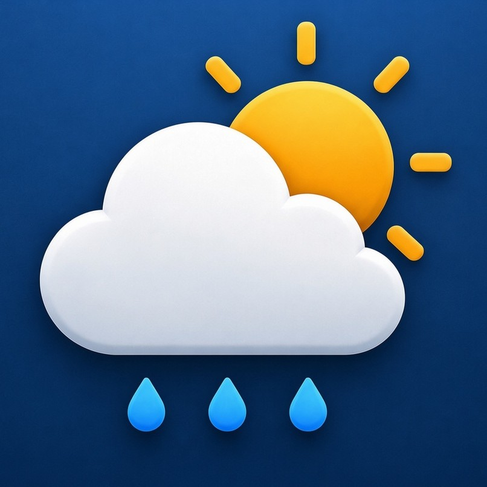
</p>

<p align="center">
  <strong>App de clima moderno, rápido e com widget na tela inicial</strong><br/>
  Desenvolvido em Flutter com Material Design 3
</p>

<p align="center">
  
  
  
  
  
  
  
</p>

---

## 📱 Screenshots

<p align="center">
  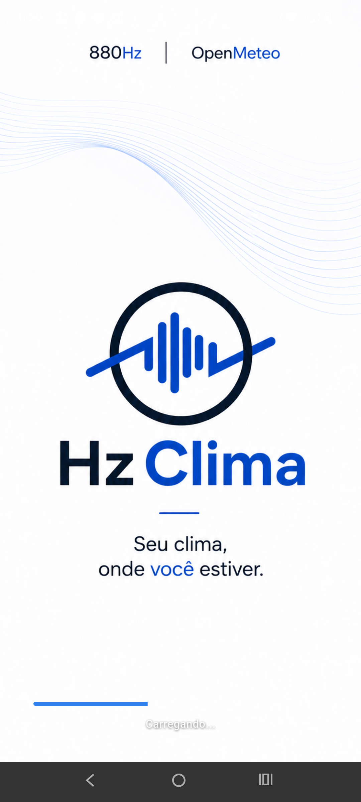
  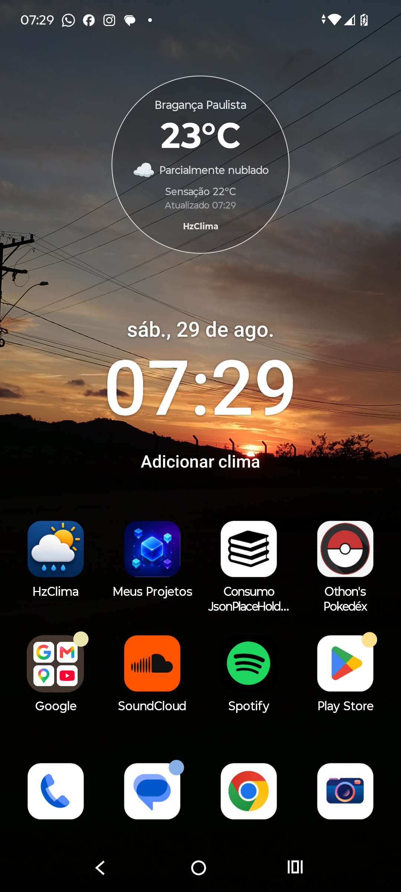
  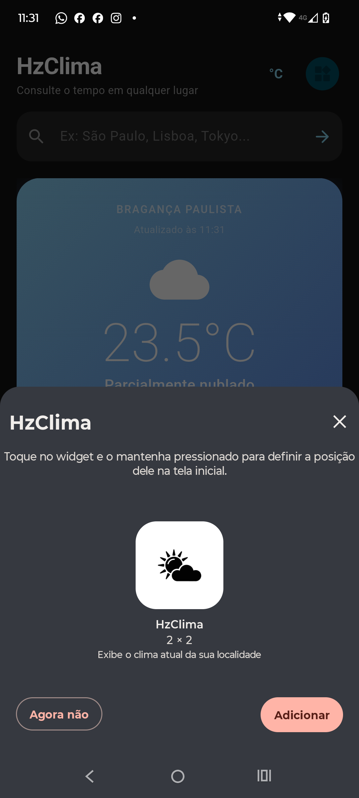
</p>

<p align="center">
  <em>Home, busca/favoritos e experiência com widget e tema escuro.</em>
</p>

<p align="center">
  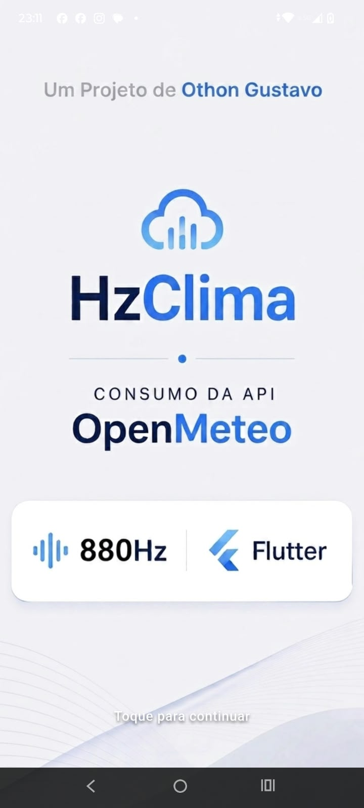
  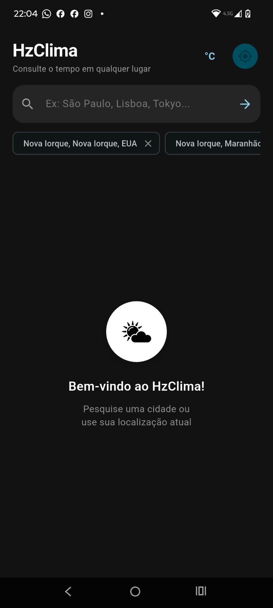
  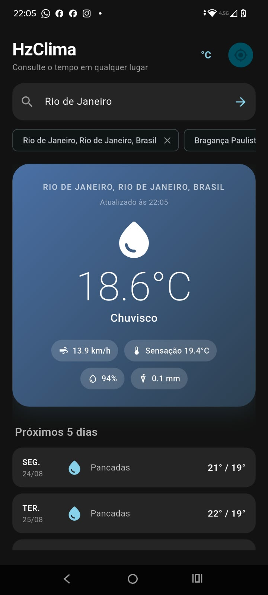
  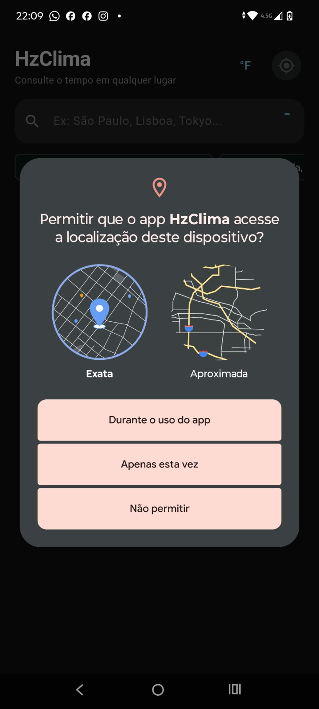
</p>

<p align="center">
  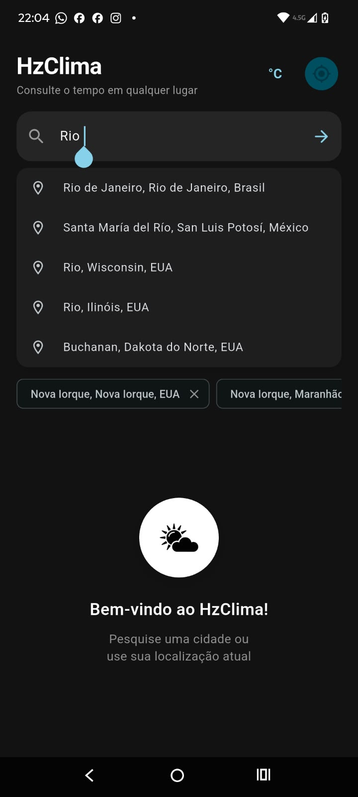
  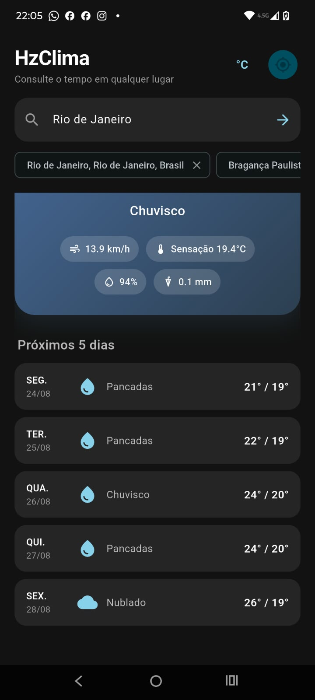
  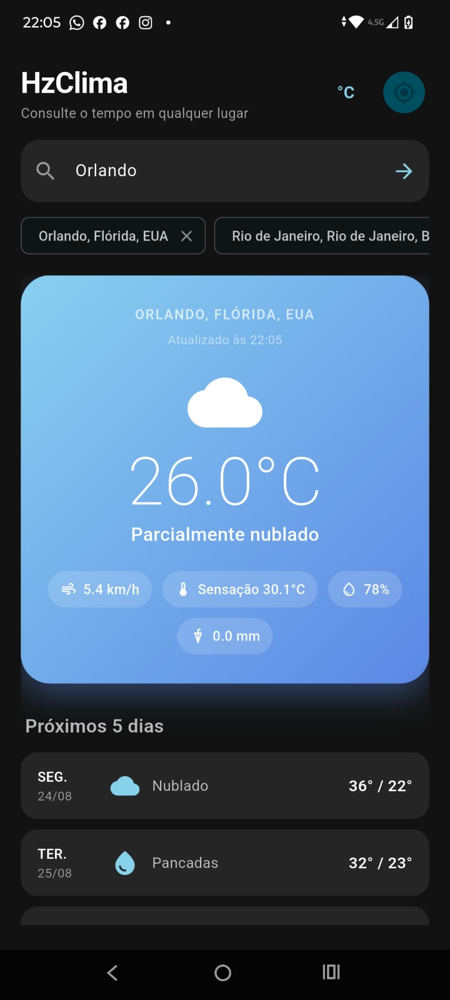
  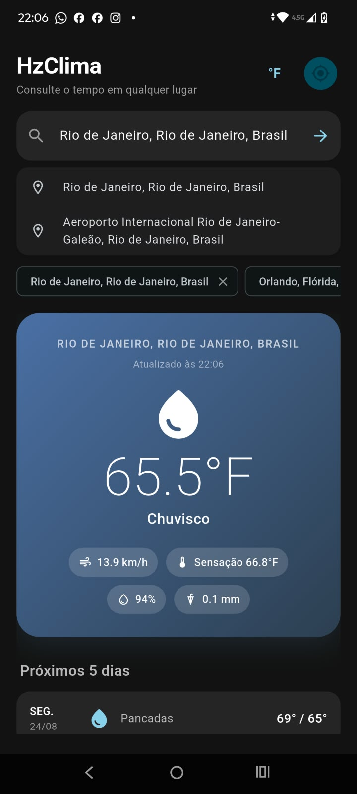
</p>

---

## ✨ Funcionalidades

* 🌦️ **Clima em tempo real** via [Open-Meteo](https://open-meteo.com/) — sem API key
* 🔎 **Busca por cidade** com autocomplete e debounce
* 📍 **Localização atual** utilizando GPS e reverse geocoding
* 📅 **Previsão de 5 dias**
* 💧 **Métricas meteorológicas**

  * Umidade
  * Sensação térmica
  * Precipitação
  * Velocidade do vento
* 🌡️ **Alternância entre °C e °F** com persistência local
* ⭐ **Favoritos de cidades** utilizando SharedPreferences
* 📱 **Widget na tela inicial do Android** utilizando `home_widget`

  * Pin do widget pelo aplicativo, quando permitido pelo sistema
  * Atualização automática a cada hora
  * WorkManager + worker nativo em Kotlin
  * Coordenadas e unidade persistidas para execução em background
* 🌓 **Tema claro, escuro e baseado no sistema**
* 🎨 **Material Design 3**
* 🚀 **Splash screen animada** com branding
* 🔄 **Pull-to-refresh** para atualização manual
* ⚠️ **Mensagens de erro amigáveis**

  * Sem internet
  * Timeout
  * Cidade não encontrada
  * Permissões
* 🔙 **Botão voltar inteligente**

  * Fecha teclado/sugestões primeiro
  * Dois toques para sair
* ✨ **Animações**

  * Loading
  * Transições
  * Splash
* 📦 **Build release Android** com R8/ProGuard e regras específicas para WorkManager

---

# 🛠️ Stack & Competências

## 💻 Linguagens e Frameworks

| Tecnologia            | Uso no projeto                               |
| --------------------- | -------------------------------------------- |
| **Dart 3**            | Linguagem principal                          |
| **Flutter**           | Desenvolvimento da interface multiplataforma |
| **Material Design 3** | Design system, temas e componentes           |

---

## 🏗️ Arquitetura

| Competência                        | Aplicação                                                      |
| ---------------------------------- | -------------------------------------------------------------- |
| **Arquitetura em camadas**         | `models`, `services`, `providers`, `pages`, `widgets`, `utils` |
| **State Management**               | Provider + ChangeNotifier                                      |
| **Separação de responsabilidades** | UI desacoplada da lógica de negócio e das APIs                 |
| **Helpers**                        | `WeatherCodeHelper` para ícones, textos e gradientes           |

---

## 🌐 Dados e Rede

| Competência                     | Aplicação                                                   |
| ------------------------------- | ----------------------------------------------------------- |
| **API REST**                    | Comunicação HTTP + JSON                                     |
| **Open-Meteo Forecast**         | Clima atual e previsão                                      |
| **Open-Meteo Geocoding**        | Busca e autocomplete de cidades                             |
| **Reverse Geocoding**           | Conversão de coordenadas em nome da cidade                  |
| **Tratamento de erros de rede** | `SocketException`, `TimeoutException` e mensagens amigáveis |

---

## 📱 Dispositivo, Widget e Persistência

| Competência                   | Aplicação                                             |
| ----------------------------- | ----------------------------------------------------- |
| **Geolocalização**            | `geolocator` + gerenciamento de permissões            |
| **Persistência local**        | SharedPreferences para favoritos e unidade            |
| **Home Screen Widget**        | `home_widget` + `WeatherHomeWidgetProvider` em Kotlin |
| **Atualização em background** | WorkManager + `WeatherUpdateWorker` em Kotlin         |
| **Datas e localização**       | `intl` com suporte a `pt_BR`                          |

---

## 🎨 UX / UI

| Competência              | Aplicação                          |
| ------------------------ | ---------------------------------- |
| **Animações**            | Fade, Slide e Scale                |
| **Estados de UI**        | Loading, erro e conteúdo           |
| **Autocomplete**         | Debounce nas sugestões             |
| **Favoritos**            | Chips de acesso rápido             |
| **Gradientes dinâmicos** | Card adaptado à condição climática |
| **Navegação Android**    | `PopScope` + duplo toque para sair |

---

## 🧪 Qualidade e Boas Práticas

| Competência               | Aplicação                                        |
| ------------------------- | ------------------------------------------------ |
| **Null Safety**           | Dart null-safe                                   |
| **Widgets reutilizáveis** | `WeatherCard`, `ForecastList`, `ErrorViewer`     |
| **Testabilidade**         | `http.Client` injetável para utilização de mocks |
| **Release Android**       | Minificação, R8 e ProGuard                       |
| **Ciclo de vida**         | Checks de `mounted` e `dispose`                  |

---

# 📁 Estrutura do Projeto

```text
lib/
├── main.dart
├── models/
│   └── weather_model.dart
│       └── WeatherModel
│       └── DailyForecast
│       └── CitySuggestion
│
├── services/
│   ├── weather_service.dart
│   │   └── API, geocoding e localização
│   │
│   └── widget_service.dart
│       └── Dados do widget e pin
│
├── providers/
│   └── weather_provider.dart
│       └── Estado global com Provider
│
├── pages/
│   ├── splash_page.dart
│   └── home_page.dart
│
├── widgets/
│   ├── weather_card.dart
│   ├── forecast_list.dart
│   └── error_viewer.dart
│
└── utils/
    └── weather_code_helper.dart
        └── Ícones, textos e gradientes

android/app/src/main/
├── AndroidManifest.xml
│
├── kotlin/.../weather_app/
│   ├── MainActivity.kt
│   ├── WeatherHomeWidgetProvider.kt
│   │   └── Provider do widget
│   │
│   └── WeatherUpdateWorker.kt
│       └── Atualização horária em background
│
└── res/
    ├── layout/
    │   └── weather_home_widget.xml
    │
    └── xml/
        └── weather_home_widget_info.xml
```

---

# 🚀 Como Rodar

## 📋 Pré-requisitos

* Flutter SDK **3.13+**
* Dart compatível com a versão instalada do Flutter
* Android Studio e/ou Xcode
* Emulador ou dispositivo físico
* Git

---

## 📥 Clonar o projeto

```bash
git clone https://github.com/othongustavo99/weather-app.git
cd weather-app
flutter pub get
```

---

## ▶️ Executar

```bash
flutter run
```

---

# 📦 Build Release — Android

Para gerar uma versão de produção:

```bash
flutter build apk --release
```

O APK será gerado em:

```text
build/app/outputs/flutter-apk/app-release.apk
```

Também é possível executar diretamente em modo release:

```bash
flutter run --release
```

> A configuração de release utiliza R8/ProGuard e regras específicas para manter o funcionamento do WorkManager e do widget Android.

---

# 🔐 Permissões

## Android

Arquivo:

```text
android/app/src/main/AndroidManifest.xml
```

Permissões utilizadas:

```xml
<uses-permission android:name="android.permission.INTERNET"/>
<uses-permission android:name="android.permission.ACCESS_FINE_LOCATION"/>
<uses-permission android:name="android.permission.ACCESS_COARSE_LOCATION"/>
<uses-permission android:name="android.permission.RECEIVE_BOOT_COMPLETED"/>
```

### Finalidade

| Permissão                | Finalidade                                                  |
| ------------------------ | ----------------------------------------------------------- |
| `INTERNET`               | Comunicação com as APIs meteorológicas                      |
| `ACCESS_FINE_LOCATION`   | Obtenção da localização precisa                             |
| `ACCESS_COARSE_LOCATION` | Obtenção de localização aproximada                          |
| `RECEIVE_BOOT_COMPLETED` | Permite que o sistema reagende tarefas após reinicialização |

---

## 🍎 iOS

Arquivo:

```text
ios/Runner/Info.plist
```

Configuração de localização:

```xml
<key>NSLocationWhenInUseUsageDescription</key>
<string>Precisamos da sua localização para mostrar o clima local.</string>
```

---

# 🔌 APIs Utilizadas

| API                                                                  | Função                                   | Autenticação |
| -------------------------------------------------------------------- | ---------------------------------------- | ------------ |
| [Open-Meteo Forecast](https://open-meteo.com/)                       | Clima atual e previsão de 5 dias         | Sem API key  |
| [Open-Meteo Geocoding](https://open-meteo.com/en/docs/geocoding-api) | Busca e autocomplete de cidades          | Sem API key  |
| **BigDataCloud**                                                     | Reverse geocoding — coordenadas → cidade | Sem API key  |

---

# 📦 Principais Dependências

```yaml
dependencies:
  flutter:
    sdk: flutter

  http: ^1.6.0
  geolocator: ^13.0.2
  intl: ^0.19.0
  shared_preferences: ^2.5.3
  provider: ^6.1.5
  home_widget: ^0.7.0
  cupertino_icons: ^1.0.8
```

> As versões efetivamente utilizadas pelo projeto podem ser consultadas no `pubspec.lock`.

No Android nativo, o projeto também utiliza:

```text
androidx.work:work-runtime-ktx
```

para o agendamento das atualizações do widget.

---

# 🧩 Widget e Atualização em Background

O widget da tela inicial funciona integrado ao Flutter e ao código nativo Android.

### Fluxo

```text
Flutter
   │
   ├── Dados meteorológicos
   ├── Cidade
   ├── Temperatura
   ├── Descrição
   ├── Latitude
   ├── Longitude
   └── Unidade
        │
        ▼
   home_widget
        │
        ▼
WeatherHomeWidgetProvider
        │
        ▼
   Widget Android
```

### Atualização automática

O widget é atualizado automaticamente através do **WorkManager**.

A cada execução, o `WeatherUpdateWorker`:

1. Lê as coordenadas armazenadas.
2. Recupera a unidade configurada.
3. Consulta a API Open-Meteo.
4. Atualiza os dados meteorológicos.
5. Salva os novos dados no armazenamento local.
6. Atualiza todos os widgets ativos.

As coordenadas somente são armazenadas quando existem valores válidos, evitando falhas durante a execução em background.

> ⚠️ Em alguns dispositivos Android, mecanismos como economia de bateria e Doze podem atrasar a execução. Portanto, o intervalo de 1 hora representa o agendamento mínimo desejado, não uma garantia de execução exatamente a cada 60 minutos.

---

# 🧪 Testes

Para executar os testes:

```bash
flutter test
```

A estrutura de testes contempla:

* Models
* Services
* Provider
* Widgets
* Persistência
* Mock de requisições HTTP através de `http.Client`

---

# 🎯 Objetivos de Aprendizado

O HzClima foi desenvolvido como projeto de estudo e portfólio, reunindo diferentes conceitos de desenvolvimento mobile.

### Principais conhecimentos aplicados

1. Desenvolvimento de um aplicativo Flutter completo
2. Integração com APIs REST públicas
3. Consumo e tratamento de JSON
4. Tratamento de erros de rede
5. State Management com **Provider**
6. Persistência local com **SharedPreferences**
7. Geolocalização e gerenciamento de permissões
8. Comunicação entre Flutter e Android nativo
9. Desenvolvimento de **Home Screen Widget**
10. Atualização em background utilizando **WorkManager**
11. Material Design 3
12. Temas claro, escuro e sistema
13. Animações e transições
14. Gerenciamento dos estados de loading, erro e conteúdo
15. Testes unitários e testes de widgets
16. Build de produção para Android
17. R8 e ProGuard
18. Organização arquitetural em camadas
19. Separação de responsabilidades
20. Boas práticas de ciclo de vida no Flutter

---

# 💼 Portfólio

O **HzClima** foi desenvolvido para ir além de um simples projeto de consumo de API.

O aplicativo reúne, em um único projeto:

* 🌐 Consumo de APIs REST reais
* 🏗️ Arquitetura organizada em camadas
* 🔄 Gerenciamento de estado com Provider
* 💾 Persistência local
* 📍 Geolocalização
* 📱 Integração com funcionalidades nativas do Android
* 🧩 Home Screen Widget
* ⚙️ Execução em background com WorkManager
* 🎨 Material Design 3
* 🌓 Dark Mode
* ✨ Animações
* ⚠️ Tratamento de erros
* 🧪 Testes
* 📦 Build de produção
* 🔐 Configuração de permissões
* 🛡️ R8/ProGuard

O projeto representa uma aplicação prática de conceitos estudados durante o desenvolvimento mobile com **Flutter e Dart**, além da integração com recursos nativos do Android utilizando **Kotlin**.

---

# 📄 Licença

Este projeto está sob a licença **MIT**.

Você pode utilizar, estudar, modificar e adaptar o código de acordo com os termos da licença.

---

<p align="center">
  Desenvolvido com Flutter 💙
</p>

<p align="center">
  <strong>HzClima</strong> — clima de forma simples, rápida e inteligente.
</p>
